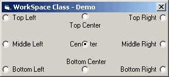

<div align="center">

## WorkSpace Class


</div>

### Description

Class object that gets the systems available screen workspace dimmentions and can also position a form to one of 9 screen quadrants. All API.. No SysInfo Control!
 
### More Info
 
Input Form to position and additive enumerations signifying the desired position.

Also include an AutoRefresh flag if you want the screen metrics updated on each system call.

Provides property values to return workspace dimmentions if needed

None that I am aware of...


<span>             |<span>
---                |---
**Submitted On**   |2002-03-16 12:18:24
**By**             |[Dane Jones](https://github.com/Planet-Source-Code/PSCIndex/blob/master/ByAuthor/dane-jones.md)
**Level**          |Intermediate
**User Rating**    |5.0 (10 globes from 2 users)
**Compatibility**  |VB 5\.0, VB 6\.0
**Category**       |[Miscellaneous](https://github.com/Planet-Source-Code/PSCIndex/blob/master/ByCategory/miscellaneous__1-1.md)
**World**          |[Visual Basic](https://github.com/Planet-Source-Code/PSCIndex/blob/master/ByWorld/visual-basic.md)
**Archive File**   |[WorkSpace\_626913162002\.zip](https://github.com/Planet-Source-Code/dane-jones-workspace-class__1-32746/archive/master.zip)

### API Declarations

```
Private Declare Function SystemParametersInfo Lib "user32" Alias "SystemParametersInfoA" (ByVal uAction As Long, ByVal uParam As Long, lpvParam As Any, ByVal fuWinIni As Long) As Long
```


